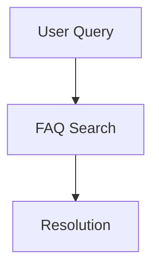

## Account and Setup Issues

Ye Ye Documentation provides a seamless way to manage your project docs. Use the expandable sections below to find quick answers to common account and setup questions.

<ExpandableGroup>

<Expandable title="How do I create a new account?">

Follow these steps to sign up:

<Steps>
  <Step title="Visit the site" icon="globe">
    Go to `https://ye-ye-docs.com` and click **Sign Up**.
  </Step>
  <Step title="Enter details" icon="user">
    Provide your email, username, and a strong password.
  </Step>
  <Step title="Verify email" icon="mail">
    Check your inbox and click the verification link.
  </Step>
</Steps>

<Callout kind="tip">
  Enable two-factor authentication immediately after setup for added security.
</Callout>

</Expandable>

<Expandable title="What if I forgot my password?">
Click **Forgot Password** on the login page. Enter your email to receive a reset link valid for 15 minutes. If you do not receive it, check your spam folder.
</Expandable>

</ExpandableGroup>

## Document Management Tips

Organize your documentation efficiently with these best practices.

<Columns cols={2}>
  <Card title="Version Control" icon="git-branch" href="#">
    Use Git integration to track changes across document versions.
  </Card>
  <Card title="Search Optimization" icon="search" href="#">
    Add keywords to titles and descriptions for better discoverability.
  </Card>
</Columns>

<Expandable title="How do I add a new document?">

1. Navigate to your workspace dashboard.
2. Click **New Document**.
3. Enter a title and select a folder.

For code-heavy docs, structure like this:

<CodeGroup tabs="Markdown,MDX">
```markdown
# Document Title

## Section

Content here.
```
```jsx
---
title: "Document Title"
---

## Section

<Callout kind="info">Inline components work here.</Callout>
```
</CodeGroup>

</Expandable>

## Troubleshooting Common Errors

Resolve issues quickly with these targeted fixes.

<Tabs>
  <Tab title="Publishing Errors" icon="alert-triangle">

Common publishing failures and solutions:

| Error Message              | Cause                          | Fix                                      |
|----------------------------|--------------------------------|------------------------------------------|
| `Build timeout exceeded`   | Large assets or complex MDX    | Optimize images and split large files    |
| `Invalid frontmatter`      | Syntax errors in YAML          | Check for blank lines in `---` blocks    |
| `Component not found`      | Missing import                 | Verify PascalCase and available components |

  </Tab>
  <Tab title="Sync Issues" icon="refresh-cw">

<Steps>
  <Step title="Clear cache" icon="trash-2">
    Run `npm run clean` in your repo root.
  </Step>
  <Step title="Re-pull changes" icon="git-pull-request">
    Execute `git pull origin main`.
  </Step>
  <Step title="Restart preview" icon="play">
    Use `npm run dev` to preview updates.
  </Step>
</Steps>

<Callout kind="warning">
  Always commit changes before syncing to avoid data loss.
</Callout>

  </Tab>
</Tabs>

<Expandable title="Why does my Mermaid diagram not render?">

Ensure you use proper code block syntax, not a component:

````markdown

````

Avoid `<Mermaid>` tags—they cause parsing errors.

</Expandable>