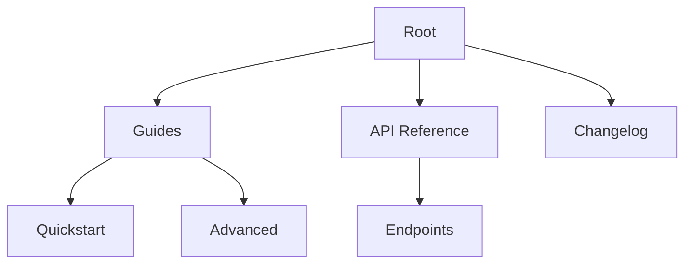

## Overview

Ye Ye Documentation provides a powerful platform for creating, managing, and sharing project documentation. You organize content using Markdown and MDX, collaborate with teams, and structure hierarchies for easy navigation. This guide covers editing, collaboration, and structuring your docs.

<Callout kind="info">
  Start with the basics: Ye Ye supports real-time editing and version control for seamless teamwork.
</Callout>

## Editing and Formatting Documents

Edit documents directly in the web editor or use your preferred IDE. Ye Ye renders Markdown and MDX with full support for components like `<Callout>` and `<Steps>`.

Follow these steps to format your content effectively.

<Steps>
  <Step title="Open a Document" icon="edit-3">
    Navigate to your project and select a `.mdx` file. The editor loads with syntax highlighting.
  </Step>
  <Step title="Add Headings and Lists" icon="list">
    Use standard Markdown: `## Heading`, `- Item`. For rich components, insert JSX like `<Image src="..." alt="..." />`.
  </Step>
  <Step title="Preview Changes" icon="eye">
    Toggle live preview to see rendered output. Test components and ensure no parsing errors.
  </Step>
  <Step title="Save and Commit" icon="save">
    Commit changes with a descriptive message. Ye Ye auto-generates previews for review.
  </Step>
</Steps>

<CodeGroup tabs="Markdown,MDX">
  ```markdown
  ## Welcome

  - Feature 1
  - Feature 2

  Response time: `<1s`
  ```
  ```mdx
  ## Welcome

  <Callout kind="tip">Try this feature.</Callout>

  - Feature 1
  - Feature 2

  Response time: `<1s`
  ```
</CodeGroup>

## Collaboration and Sharing Features

Collaborate by inviting team members and sharing links. Ye Ye includes real-time cursors, comments, and version history.

<Tabs>
  <Tab title="Invite Collaborators" icon="users">
    Go to project settings and add emails. Collaborators gain edit or view access.

    <Image
      src="https://example.com/invite.png"
      alt="Invite collaborators screen"
      width="600"
      height="400"
    />
  </Tab>
  <Tab title="Share Public Links" icon="share-2">
    Publish docs to generate shareable URLs. Customize permissions for public read access.

    Use embeds: `<Iframe src="https://ye-ye-docs.com/project" title="Docs Embed" />`
  </Tab>
  <Tab title="Version Control" icon="git-branch">
    Track changes with Git integration. Revert to previous versions or merge branches.
  </Tab>
</Tabs>

<Callout kind="tip">
  Enable notifications in settings to stay updated on edits.
</Callout>

## Structuring Documentation Hierarchies

Organize docs into logical hierarchies using folders and navigation menus. This ensures users find information quickly.

<Columns cols={3}>
  <Card title="Flat Structure" icon="layout" href="#">
    Simple projects: All files in root. Use frontmatter for sidebar ordering.
  </Card>
  <Card title="Nested Folders" icon="folder" href="#">
    Complex docs: `guides/`, `api/`, `changelog/`. Auto-generates sidebar.
  </Card>
  <Card title="Custom Navigation" icon="menu" href="#">
    Edit `nav.yaml` for precise control over menu items and groups.
  </Card>
</Columns>



<ExpandableGroup>
  <Expandable title="Advanced Hierarchy Tips" default-open="false">
    Use `sidebar: true` in frontmatter to include pages automatically. For custom icons, add `icon: "book-open"`.

    | Hierarchy Type | Use Case | Example |
    |----------------|----------|---------|
    | Flat | Small projects | `/docs/page1.mdx` |
    | Nested | Large docs | `/guides/user.mdx` |
    | Custom Nav | Themed sections | Groups in `nav.yaml` |
  </Expandable>
</ExpandableGroup>

Master these features to build scalable documentation that grows with your project. Explore templates in the dashboard to accelerate setup.