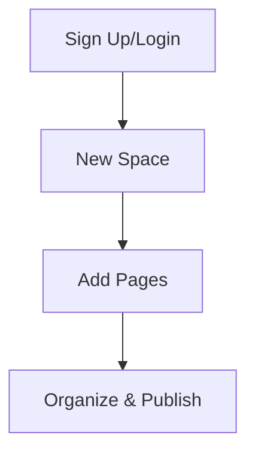

## Overview

Ye Ye Documentation helps you organize project docs efficiently. You create spaces for teams, add pages with MDX, and structure content hierarchically. Follow these steps to set up your first space in minutes.

<Callout kind="tip">
  Use your brand color `#3B82F6` in custom themes for a personalized look.
</Callout>

## Account Setup and Login

Start by creating an account.

<Steps>
  <Step title="Sign Up" icon="user-plus">
    Visit `https://ye-ye-docs.com/signup` and enter your email, name, and password.
    
    Verify your email via the confirmation link.
  </Step>
  
  <Step title="Log In" icon="log-in">
    Go to `https://ye-ye-docs.com/login`.
    
    Enter your credentials. Enable two-factor authentication for security.
  </Step>
</Steps>

## Create Your First Documentation Space

Spaces group related docs. Create one for your project.

<Steps>
  <Step title="New Space" icon="plus">
    From the dashboard, click **New Space**.
    
    Name it `My Project Docs` and set visibility to private or public.
  </Step>
  
  <Step title="Configure Space" icon="settings">
    Add a description: "Documentation for My Project".
    
    Upload a logo and set the brand color to `#3B82F6`.
  </Step>
</Steps>



## Add and Organize Basic Pages

Add pages using the editor. Organize with navigation.

<Tabs>
  <Tab title="Homepage" icon="home">
    Create `index.mdx`:
    
````mdx
```mdx
---
title: Welcome
description: Project overview
---

## Introduction

Your content here.
```
````
    
    Save and preview.
  </Tab>
  
  <Tab title="API Reference" icon="code">
    Add `api.mdx`:
    
    <CodeGroup tabs="Request,Response">
```javascript
const response = await fetch('https://api.ye-ye-docs.com/v1/spaces', {
  headers: { 'Authorization': 'Bearer YOUR_TOKEN' }
});
```
```json
{
  "spaces": [
    { "id": "space-123", "name": "My Project Docs" }
  ]
}
```
    </CodeGroup>
  </Tab>
</Tabs>

<ParamField path="spaceId" param-type="string" required="true">
  Unique space identifier.
</ParamField>

## Organize Navigation

Drag pages in the sidebar to set hierarchy. Use frontmatter for titles.

<Expandable title="Advanced Organization" default-open="false">
  Nest pages under sections:
  
  | Page Type    | Path Example       | Use Case              |
  |--------------|--------------------|-----------------------|
  | Homepage     | `/index.mdx`       | Landing page          |
  | Guide        | `/guides/quickstart.mdx` | Tutorials         |
  | API          | `/api/reference.mdx`    | Endpoint docs     |
  
  Link pages with `[Quickstart](/guides/quickstart)`.
</Expandable>

## Next Steps

<Columns cols={3}>
  <Card title="Customize Themes" icon="palette" href="/docs/themes">
    Apply `#3B82F6` and custom CSS.
  </Card>
  
  <Card title="Collaborate" icon="users" href="/docs/teams">
    Invite team members and set permissions.
  </Card>
  
  <Card title="Version Control" icon="git-branch" href="/docs/git">
    Connect GitHub for sync.
  </Card>
</Columns>

<Callout kind="success">
  Your first space is ready! Publish to share with your team.
</Callout>